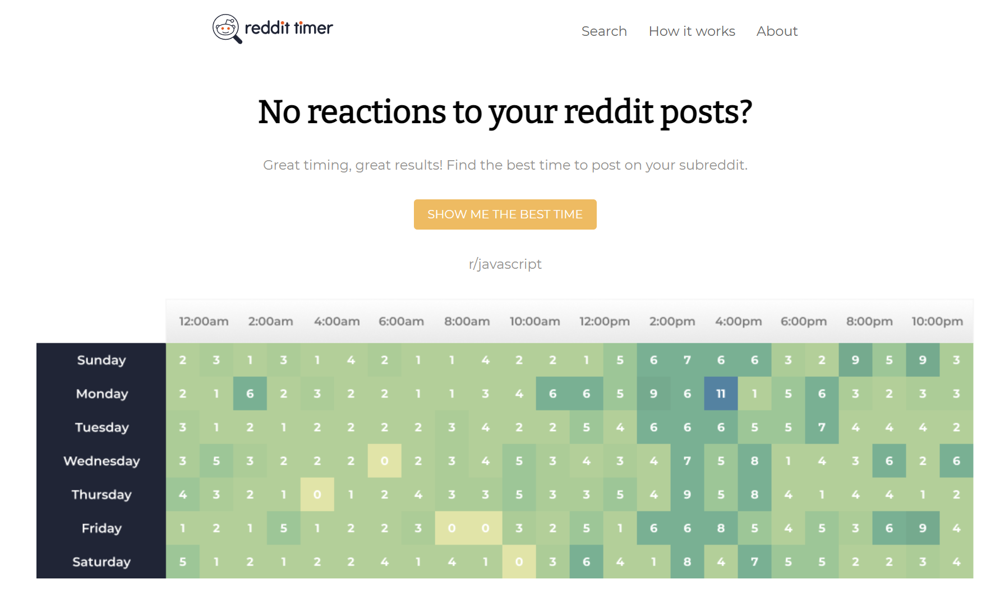
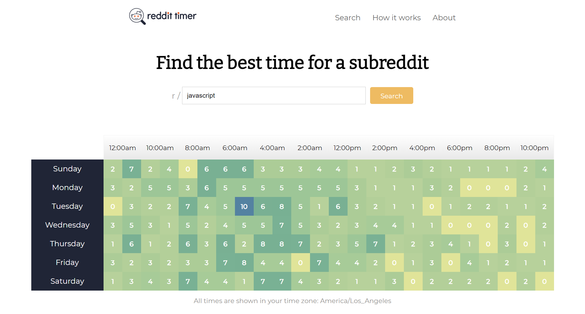

<h1 align="center"> Reddit Timer</h1>
<h2 align="center"> It helps you figure out when to post based on when other successful posts were created</h2>
<a href="https://reddit-timer-wjkmartin.herokuapp.com/"><h3 align="center">You can try it here</h3></a>
<br />
<p align="center">
  
  <a href="#" target="_blank">
    
  </a>
</p>




<h2 align="center"> The heatmap demonstrates the highest concentrations of successful posts at a glance.</h2>
<br />



## About This Project

This project was completed as part of the premium course at [profy.dev](https://profy.dev/employers). This course mimics a professional real world development environment.

Designs were provided via [Figma](https://www.figma.com/). The project was split into small tasks using [ClickUp](https://clickup.com/) as a project management tool. I created a pull request for every task.

Here's what I learned while working on this project:

* **Creating pixel-perfect designs**
* **Creating custom React hooks [[1]](https://github.com/profydev/reddit-timer-wjkmartin/blob/main/src/hooks/useInput.js)[[2]](https://github.com/profydev/reddit-timer-wjkmartin/blob/main/src/hooks/useFetchPosts.js)**
* **[Implement data fetching with error handling](https://github.com/profydev/reddit-timer-wjkmartin/blob/main/src/hooks/useFetchPosts.js)**
* **Writing integration tests**
* **Professional Git workflow with pull requests**
* **Code reviews**
* **Continuous integration**

I was given designs, user stories, and acceptance criteria and was given full control over the implementation details as long as I used React. 

The code reviews gave me insights into best practices to follow (see [this example](https://github.com/profydev/reddit-timer-wjkmartin/pull/7#pullrequestreview-805303855)). I was able to learn a lot and evolve my front-end knowledge rapidly.

## Tech Stack
 * React (+Hooks)
 * React Router
 * React Testing Suite + Cypress

## Tools Use for the Project
* [Figma](https://www.figma.com/) - This is where the designs live.
* [Perfect Pixel](https://chrome.google.com/webstore/detail/perfectpixel-by-welldonec/dkaagdgjmgdmbnecmcefdhjekcoceebi?hl=en) - To help verify a pixel perfect layout.
* [ClickUp](https://clickup.com/) - Kanban board for project management.
* Github - Version control & team collaboration
* Slack - Team communication tool

### Install
```sh
yarn install
```

### Usage
```sh
yarn start
```

### Run tests
```sh
yarn run cypress
yarn test
```

## Author
🧙‍♂️ **Will Martin**

* Website: https://willmartin.ca - please feed the dog.
* LinkedIn: [William Martin](https://www.linkedin.com/in/william-martin-a1890b184/)
